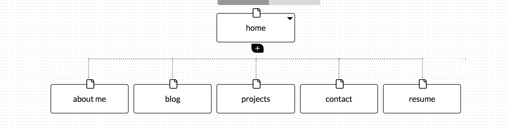

#What are the 6 Phases of Web Design?
1.) Information Gathering
		Collecting relevant information about the project like purpose, target audience, and required content.
2.) Planning
		This when tools to be used are chosen such CMS and what languages to use.
3.) Design
		Design is probably the funnest part of all the phases. This is when the aesthetics and feel of the site are decided - color palette, theme, flow, etc.
4.) Development
		The nitty and gritty phase of development. This is when the developer takes the design from the previous phase and executes on it with actual code.
5.) Testing and Delivery
		This phase makes sure that all components of the site are functioning as designed and presents to the client.
6.) Maintenance
		Content ages and as such needs to be updated from time to time. This phase ensures that the website maintains relevant content and stays alive.

#What is your site's primary goal or purpose? What kind of content will site feature?
The main goal of my site is to showcase myself and my progress through DBC and beyond to potential employers and colleagues. Visitors will find content such as my resume, portfolio, background, and ways to contact me.

#What is the primary "action" the user should take when coming to your site?
The flow of "action" I'd like visitors to engage is as follows: Checkout my portfolio, checkout my background, assess whether or not I'm someone they'd be interested in, and follow through by making contact.

#What are the main things someone should know about design and user experience?
Design and user experience are almost one and the same in my opinion. Why would anyone want to design negatively for its users? Maybe for a one-time novelty thing. In general, I think the main thing to remember is that we are creating things for our users and as such should make their time on our products as easy and engaging as possible. No one likes to have their time wasted unncessarily.

#What is user experience design and why is it valuable?
User experience design is the idea of making products with the end user in mind. Making the product as easy and intuitive to use as possible. 

#Which parts of the challenge did you find tedious?
Not so much tedious, but I had to repush this design-reflection.md file several times before I got the relative path to my site-map right. I finally figured out that I shouldn't add a forward slash before the directory in the path. Took a solid 3-4 pushes till I got it.