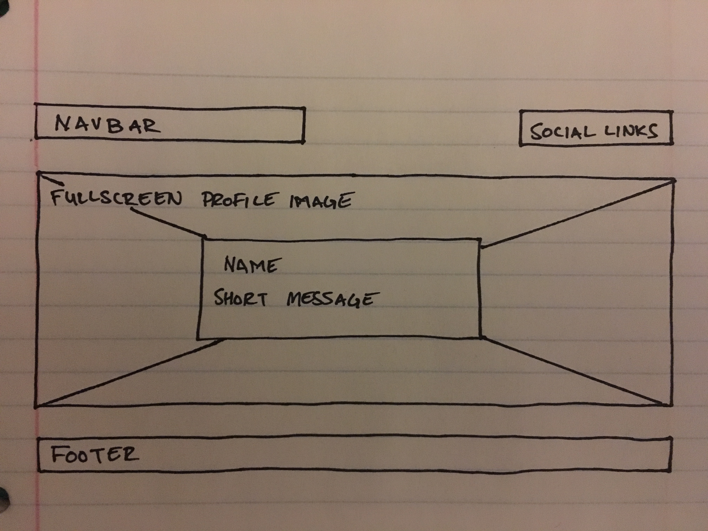
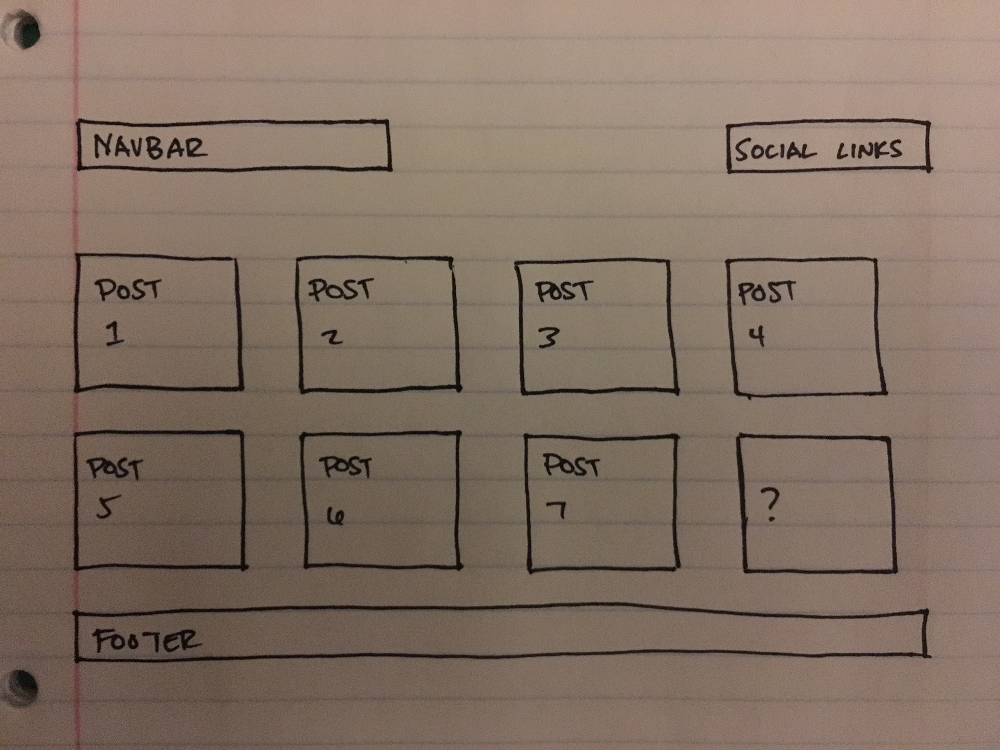

#What is a wireframe?
A wireframe is a basic layout of a site's many components. It's like an early blueprint for how the site will be built and look.

#What are the benefits of wireframing?
There are several benefits to wireframing, having a visual of a layout before investing heavily into actual code is chief among them. Wireframes are quick to build relative to an actual mockup because they are devoid of color, images, and other design elements that take away from a site's basic structure.

#Did you enjoy wireframing your site?
To be honest, not really. I wanted to get in heavily with photoshop and create an actual mockup rather than a wireframe. I found myself having to hold back and did it on paper.

#Did you revise your wireframe or stick with your first idea?
I actually threw out several wireframes before settling on a simpler design.

#What questions did you ask during this challenge? What resources did you find to help you answer them?
I went and looked up what popular grid templates are being used now and found several for the Bootstrap and MaterialCSS frameworks. I've played around with these two in the past and really liked them.

#Which parts of the challenge did you enjoy and which parts did you find tedious?
As usual I really enjoyed using the command line. It just feels good to use and know that I actually understand what's I'm doing in it (so far). I found wireframing to be kind of boring, but I do understand its merits.