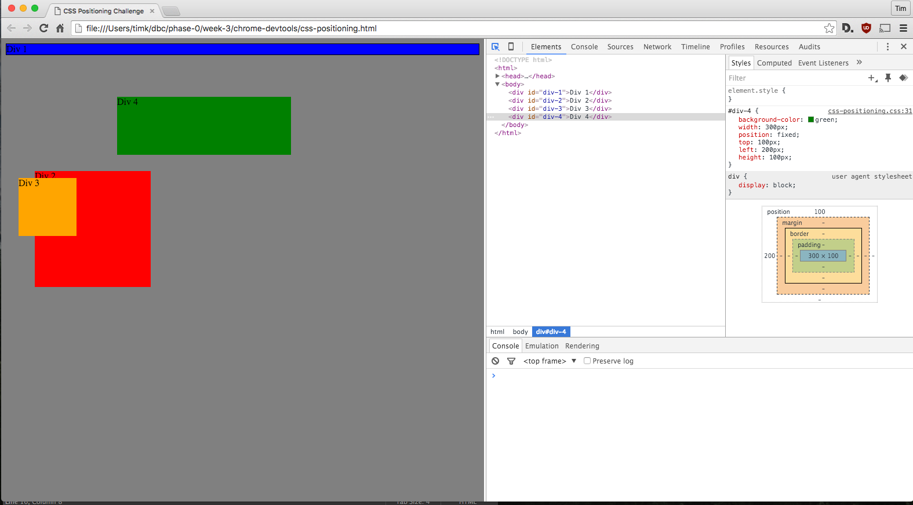
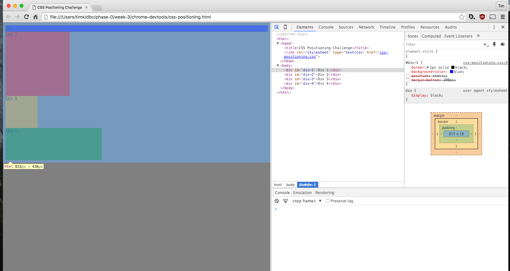
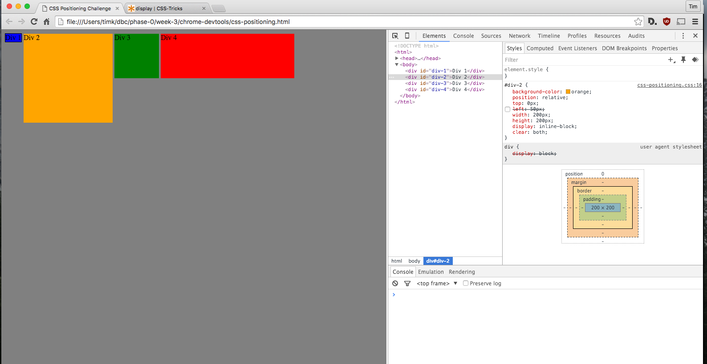
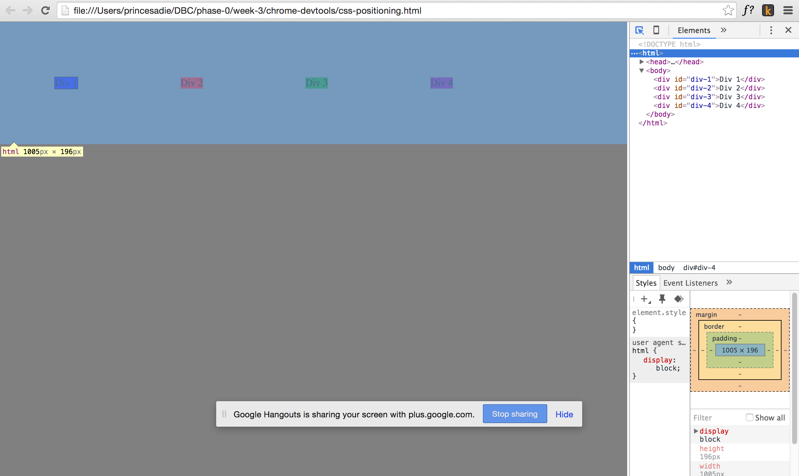
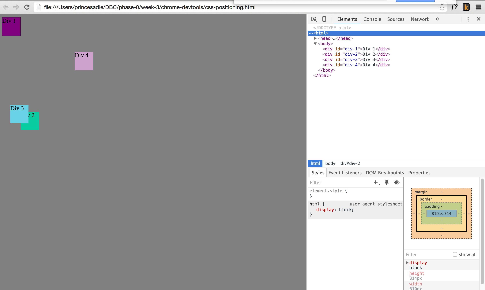
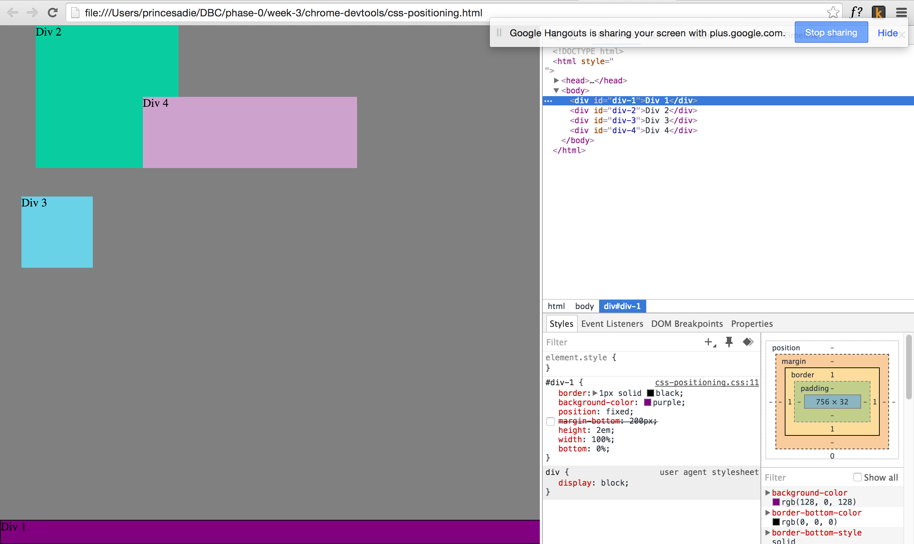
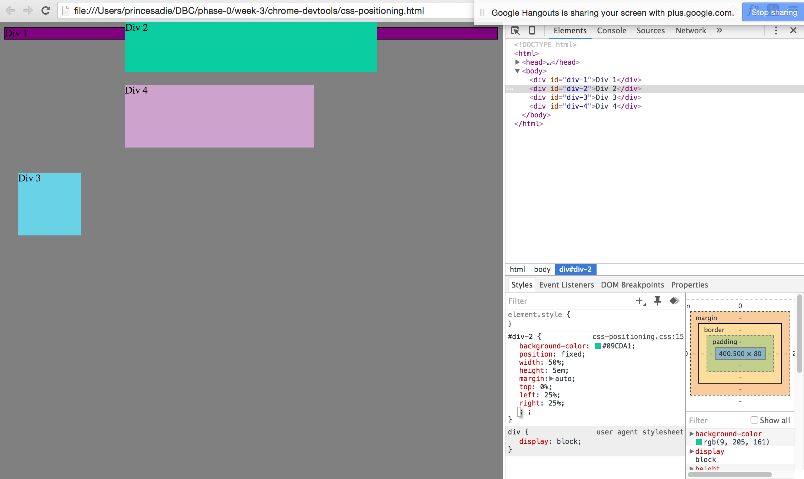
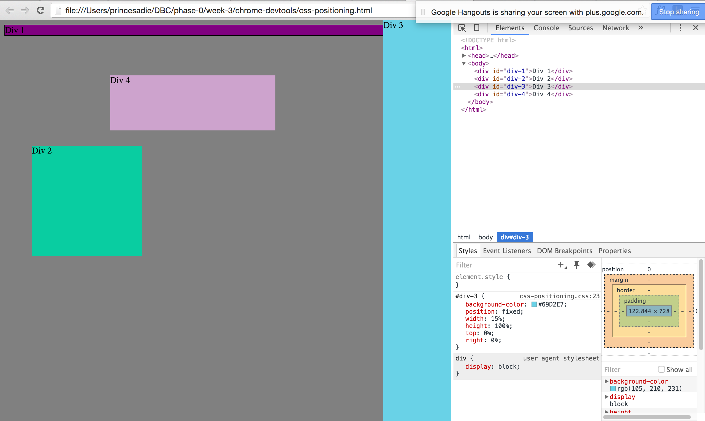
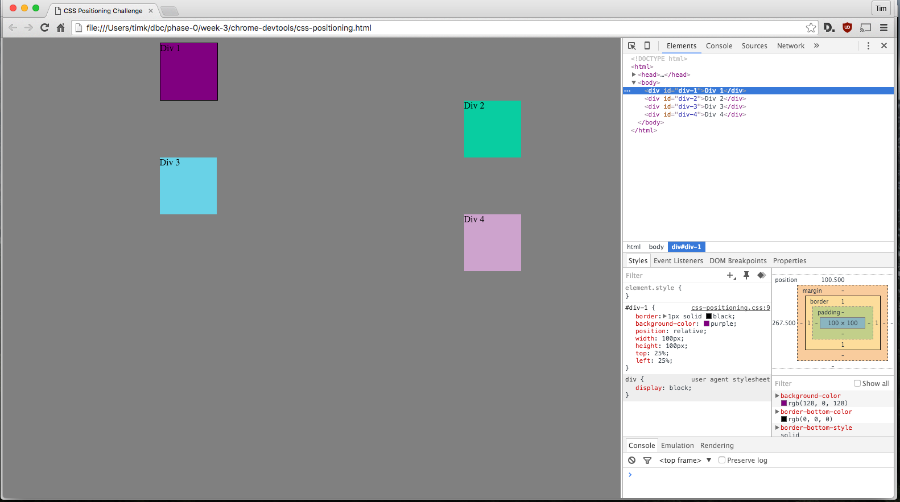

#1 Changing the Colors

#2 Column

#3 Row

#4 Make Equidistant

#5 Squares

#6 Footer

#7 Header

#8 Sidebar

#9 Get Creative

#How can you use Chrome's DevTools inspector to help you format or position elements?
Chrome's DevTools inspector is pretty nifty because you can quickly see and test various positioning ideas. Being able to visualize the margins, paddings, border, and position makes it so so much more intuitive in my opinion. A super tool for a visual person like myself.

#How can you resize elements on the DOM using CSS?
Elements can be resized by setting their height and width in CSS.

#What are the differences between absolute, fixed, static, and relative positioning? Which did you find easiest to use? Which was most difficult?
Static positioning is the default position and will try to position itself exactly to it's hierarchical location on the HTML document. Relative is similar to static in that it uses the html's flow to determine position - the difference being with relative is it uses the top, bottom, left, and right attributes. Absolute is interesting because unlike the first two explained positioning, this one doesn't take into account the HTML's flow. Fixed is my favorite. This one is similar to absolute, but is relative to the browser window. This can be seen in action with many navigation bars and the chatbox in facebook for example. 

I found fixed easiest use and static/relative to be the most difficult to use.

#What are the differences between margin, border, and padding?
The margin is the outer most white space of an element. It's also the space in-between elements on a page. The border is a line dividing the margin and the padding. Padding is the inner most space and is immediately adjacent to the element itself.

#What was your impression of this challenge overall? (love, hate, and why?)
I quite enjoyed this challenge, although I had a bit of a time constraint and had to leave earlier than I would have liked at the end. This was great because a number of issues I had before were cleared up. For example, I discovered that when setting margins for an element that I must take into account the size of the element itself (it's hard for me to put into words), i.e. if my fixed positioned object's width is 50% of the screen and I want it centered then I must give it a left and/or right of 25% such that the sum is 100%.