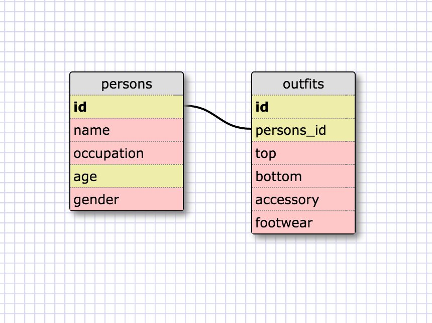

###1.)
	SELECT * FROM states;
###2.) 
	SELECT * FROM regions;
###3.) 
	SELECT state_name, population FROM states;
###4.) 
	SELECT state_name, population FROM states ORDER BY population DESC;
###5.) 
	SELECT state_name FROM states WHERE region_id = 7;
###6.) 
	SELECT state_name, population_density FROM states WHERE population_density > 50 ORDER BY population_density ASC;
###7.) 
	SELECT state_name FROM states WHERE population BETWEEN 1000000 and 1500000;
###8.) 
	SELECT state_name, region_id FROM states ORDER BY region_id ASC;
###9.) 
	SELECT region_name FROM regions WHERE region_name LIKE '%central%';
###10.) 
	SELECT regions.region_name, states.state_name FROM states INNER JOIN regions ORDER BY region_id ASC;

#REFLECTIONS
##What are databases for?
	The simple answer is that databases are great for holding a ton of information that would otherwise be too cumbersome to hold in individual arrays or hashes.
##What is a one-to-many relationship?
	A one-to-many relationship is when a one description or thing could be attributed to many different things. For instance, cars from 'toyota', 'hyundai', or 'volkswagen' could all be described as 'vehicle'. The given example of of various states belonging to certain regions of the United States.
##What is a primary key? What is a foreign key? How can you determine which is which?
	A primary key is a unique identifier given to each individual record in a table. A foreign key sits in a separate table and is often tied to and references the primary key. A primary key cannot hold null values, while a foreign key can so that'd be a dead giveaway.
##How can you select information out of a SQL database? What are some general guidelines for that?
	Accessing SQL databases is done through a keyword 'SELECT'. Similar to the general guidelines of Ruby or Javascript in that we use a set of keywords ('SELECT', 'FROM', 'LIKE', 'JOIN', etc) and end each command with a semicolon.